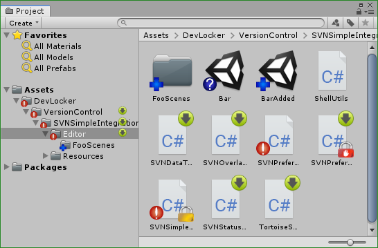
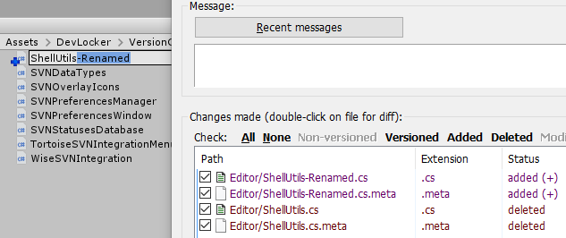
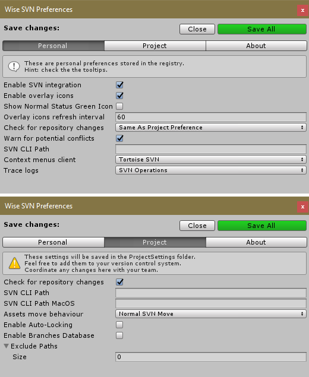
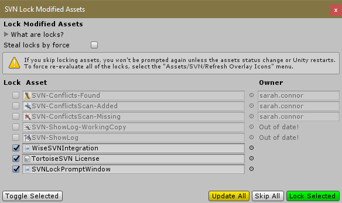
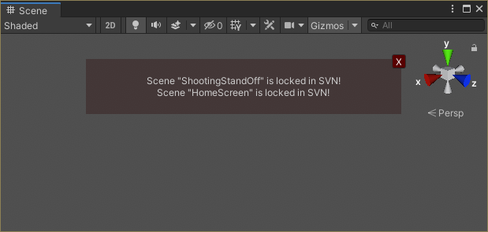
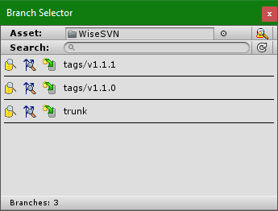

# WiseSVN For Unity

Simple but powerful SVN Integration for Unity 3D utilizing [TortoiseSVN](https://tortoisesvn.net/) (for Windows) or [SnailSVN](https://langui.net/snailsvn) (for MacOS) user interface. A must have plugin if you use SVN as your version control system in your project.

[Assets Store](https://assetstore.unity.com/packages/tools/version-control/wise-svn-162636) | [Unity Forum](https://forum.unity.com/threads/wise-svn-powerful-tortoisesvn-snailsvn-integration.844168/) | [Reddit](https://www.reddit.com/r/Unity3D/comments/fgjovk/finally_a_fully_working_tortoisesvn_snailsvn/)

[](https://openupm.com/packages/devlocker.versioncontrol.wisesvn/)

## Table of Contents
[Features](#features)<br />
[Usage](#usage)<br />
[Installation](#installation)<br />
[Overlay Icons](#overlay-icons)<br />
[Screenshots](#screenshots)<br />

## Features
* **Hooks up to Unity move and delete file operations and executes respective svn commands to stay in sync.**
  * **Handles meta files as well.**
  * Moving assets to unversioned folder will ask the user to add that folder to SVN as well.
  * Moving folders / files that have conflicts will be rejected.
  * Will work with other custom tools as long as they move / rename assets using Unity API.
* Provides assets context menu for manual SVN operations like commit, update, revert etc.
* **Show overlay svn status icons**
  * Show server changes that you need to update.
  * Show locked files by you and your colleges. 
* Displays warning in the SceneView when the current scene or edited prefab is out of date or locked.
* Lock prompt on modifying assets by path and type (perforce checkout like)
  * If asset or its meta becomes modified a pop-up window will prompt the user to lock or ignore it.
  * The window shows if modified assets are locked by others or out of date, which prevents locking them.
  * If left unlocked, the window won't prompt again for those assets. Will prompt on editor restart.
* Branch Selector
  * Scans for Unity projects in your SVN repository's branches.
  * Lists all available branches.
  * Opens Repo-Browser showing target asset in selected branch.
  * Opens "Show Log" on target asset in selected branch.
  * Switches to selected branch.
  * Scans for conflicts (shows which branches have changes to the target asset).
* Minimal performance impact
* Survives assembly reloads
* You don't have to leave Unity to do SVN chores.
* Works on Windows and MacOS (maybe Linux?).
* Simple API to integrate with your tools.
  * Use `WiseSVNIntegration.RequestSilence()` and `WiseSVNIntegration.ClearSilence()` to temporarily suppress any WiseSVN pop-ups.
  * Use `WiseSVNIntegration.RequestTemporaryDisable()` and `WiseSVNIntegration.ClearTemporaryDisable()` to temporarily disable any WiseSVN handling of file operations and updates.
  * Use `SVNContextMenusManager` methods to invoke TortoiseSVN / SnailSVN commands.
  * Use `WiseSVNIntegration.*Async()` methods to run direct SVN commands without any GUI (check `ExampleStatusWindow`).

*Check the screenshots below*

## Usage
Do your file operations in Unity and the plugin will handle the rest.

User SVN operations are available in the menu (or right-click on any asset): `Assets/SVN/...`

**WARNING: Never focus Unity while the project is updating in the background. Newly added asset guids may get corrupted in which case the Library folder needs to be deleted. <br />
Preferred workflow is to always work inside Unity - use the \"Assets/SVN/...\" menus. \"Assets/SVN/Update All\" will block Unity while updating, to avoid Unity processing assets at the same time. <br />
This is an issue with how Unity works, not the plugin iteself. Unity says its by "design".**

## Installation
* Asset Store plugin: https://assetstore.unity.com/packages/tools/version-control/wise-svn-162636
* [OpenUPM](https://openupm.com/packages/devlocker.versioncontrol.wisesvn) support:
```
npm install -g openupm-cli
openupm add devlocker.versioncontrol.wisesvn
```
* Github upm package - merge this to your `Packages/manifest.json`
```
{
  "dependencies": {
    "devlocker.versioncontrol.wisesvn": "https://github.com/NibbleByte/UnityWiseSVN.git#upm"
}
```

#### Prerequisites
* Have SVN installed
  * Have installed SVN command line interface (CLI)
* (Optional) Have [TortoiseSVN](https://tortoisesvn.net/) (for Windows) or [SnailSVN](https://langui.net/snailsvn) (for MacOS) installed.


## Overlay Icons
* Unversioned 
* Modified 
* Added 
* Deleted 
* Conflict 
* Locked by me 
* Locked by others 
* Server has changes, update 

## Screenshots










